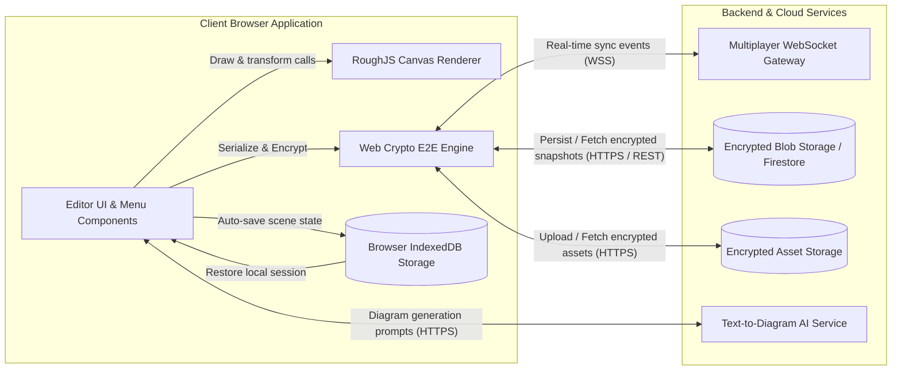

# System Architecture

## 1. Overview
The architecture is designed around a **local-first, zero-knowledge end-to-end encrypted** client application. The frontend browser runtime handles rendering, math, and cryptographic operations, while lightweight backend services handle WebSocket message broadcasting and encrypted blob persistence.

---

## 2. Architecture Diagram

---

## 3. Component Details & Communications

1. **Editor UI & Menu:**
   - Pure React component managing tool selection, context menus, layer hierarchy, and atomic application state via Jotai.
2. **RoughJS Canvas Renderer:**
   - Imperative canvas rendering layer converting abstract element geometry into sketch-styled vector strokes with smooth jitter curves.
3. **Web Crypto E2E Engine:**
   - Generates random 128-bit AES-GCM encryption keys using `window.crypto.getRandomValues`.
   - Compresses scenes via `pako` deflate before symmetric encryption.
4. **Browser LocalStore:**
   - Asynchronous storage via `idb-keyval` preserving drawing revisions, shape libraries, and user theme settings.
5. **Multiplayer WebSocket Gateway:**
   - Stateless pub/sub broker broadcasting presence, cursor trails, and versioned element patches across socket rooms.
6. **Encrypted Blob Storage:**
   - Object/document store holding encrypted scene snapshots indexed by room ID or share ID. The server never possesses decryption keys.

---

## 4. State Management Matrix

| State Type | Where It Lives | Persistence Level | Encryption |
| :--- | :--- | :--- | :--- |
| **Active Scene Elements** | Client React/Jotai In-Memory State | Ephemeral (Session) | None in memory |
| **Local Draft History** | Browser IndexedDB | Long-term on user device | Unencrypted local sandbox |
| **Room Collaborators & Cursors**| Client Memory + WebSocket Relay | Ephemeral (Live session) | Encrypted payload |
| **Shared Room Snapshots** | Remote Blob Storage / Firestore | Durable cloud storage | AES-GCM Encrypted |
| **Image Attachments** | Remote Storage Bucket | Durable cloud storage | AES-GCM Encrypted |

---

## 5. Key Architecture Decisions

1. **Zero-Knowledge URL Hash Keys (`#json=...`, `#room=...`):**
   - **Decision:** Store symmetric decryption keys exclusively in the URL fragment (hash).
   - **Why:** Browsers never transmit URL hash fragments to HTTP servers in request headers. This guarantees true end-to-end encryption without server trust.
2. **Fractional Indexing for Multiplayer Ordering:**
   - **Decision:** Utilize string-based fractional indexing (`rocicorp/fractional-indexing`) for z-index element ordering.
   - **Why:** Avoids re-indexing whole arrays during concurrent insertions by multiple users, eliminating race conditions in layer reordering.
3. **Local-First Autosave with IndexedDB:**
   - **Decision:** Decouple local canvas editing from remote network availability.
   - **Why:** Users can sketch offline without latency or network failures disrupting creative flow.
