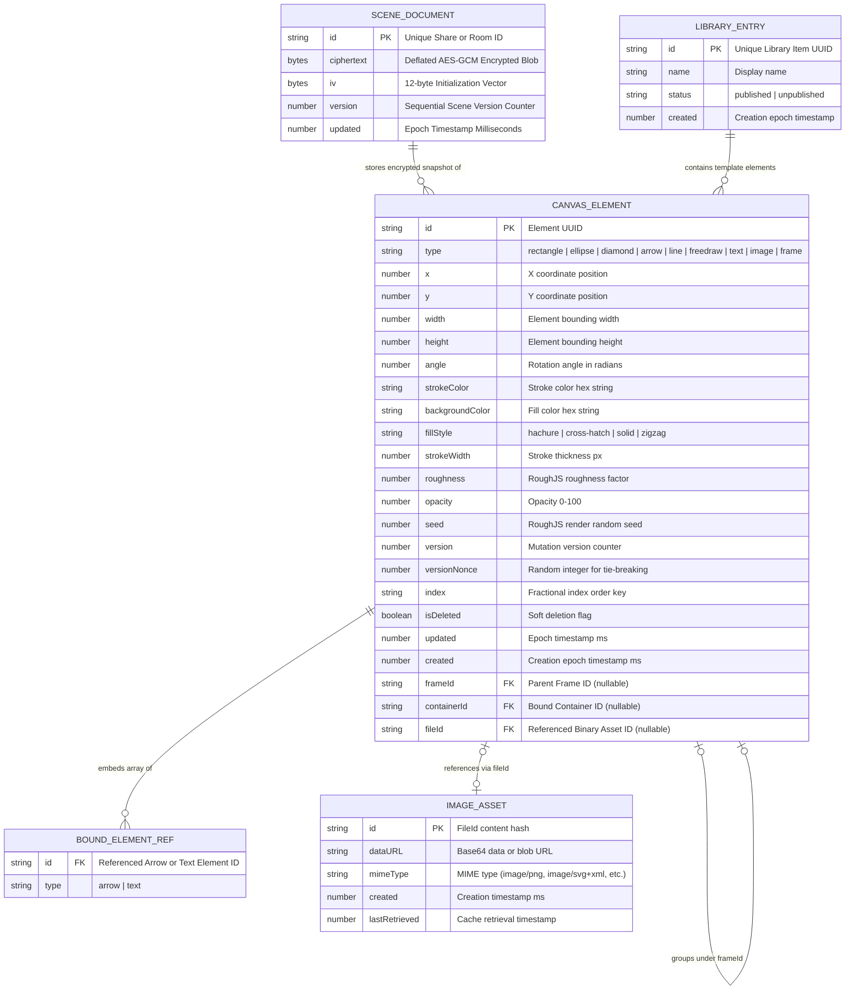

# Data Model Specification

## 1. Entity-Relationship Diagram

---

## 2. Entity Details & Schema Definitions

### 1. `SCENE_DOCUMENT`
- **Purpose:** Cloud persistence document holding an encrypted canvas snapshot.
- **Fields:**
  - `id`: `string` (Primary Key). Random hexadecimal room/share ID.
  - `ciphertext`: `bytes` (Encrypted binary array).
  - `iv`: `bytes` (12-byte initialization vector).
  - `version`: `number` (Monotonically increasing version counter).
  - `updated`: `number` (Epoch timestamp).
- **Constraints & Indexes:** Unique index on `id`.

### 2. `CANVAS_ELEMENT`
- **Purpose:** Fundamental visual item rendered on the whiteboard.
- **Fields:**
  - `id`: `string` (Primary Key). Random unique string.
  - `type`: `string` (`rectangle`, `ellipse`, `diamond`, `arrow`, `line`, `freedraw`, `text`, `image`, `frame`, `stickynote`).
  - `x`: `number` (Canvas coordinate X).
  - `y`: `number` (Canvas coordinate Y).
  - `width`: `number` (Bounding width).
  - `height`: `number` (Bounding height).
  - `angle`: `number` (Rotation angle).
  - `strokeColor`: `string` (Hex stroke color).
  - `backgroundColor`: `string` (Hex fill color).
  - `fillStyle`: `string` (`hachure`, `solid`, `cross-hatch`, `zigzag`).
  - `strokeWidth`: `number` (Line width).
  - `roughness`: `number` (RoughJS style parameter).
  - `opacity`: `number` (0 to 100).
  - `seed`: `number` (Random seed for deterministic rough path generation).
  - `version`: `number` (Incremented on every property mutation).
  - `versionNonce`: `number` (Random integer for deterministic tie-breaking in multiplayer sync).
  - `index`: `string` (Fractional indexing key for Z-order position).
  - `isDeleted`: `boolean` (Soft deletion tombstone).
  - `groupIds`: `string[]` (Array of parent group IDs ordered deepest to shallowest).
  - `frameId`: `string | null` (Foreign key to parent frame element).
  - `containerId`: `string | null` (Foreign key to parent container for bound labels).
  - `fileId`: `string | null` (Foreign key to `IMAGE_ASSET`).
  - `boundElements`: `BOUND_ELEMENT_REF[] | null` (Embedded array of bound arrow/text IDs).
  - `created`: `number | null` (Creation epoch ms).
  - `updated`: `number` (Last update epoch ms).
  - `locked`: `boolean` (Interaction lock flag).

### 3. `IMAGE_ASSET`
- **Purpose:** Stores binary image data referenced by image canvas elements.
- **Fields:**
  - `id`: `string` (Primary Key). SHA content hash identifier.
  - `dataURL`: `string` (Data URL or storage object path).
  - `mimeType`: `string` (Image format MIME type).
  - `created`: `number` (Timestamp).
  - `lastRetrieved`: `number` (Cache eviction timestamp).

### 4. `LIBRARY_ENTRY`
- **Purpose:** Reusable visual template item in shape libraries.
- **Fields:**
  - `id`: `string` (Primary Key).
  - `name`: `string` (Optional label).
  - `status`: `string` (`published` or `unpublished`).
  - `elements`: `CANVAS_ELEMENT[]` (Embedded element hierarchy).
  - `created`: `number` (Timestamp).
